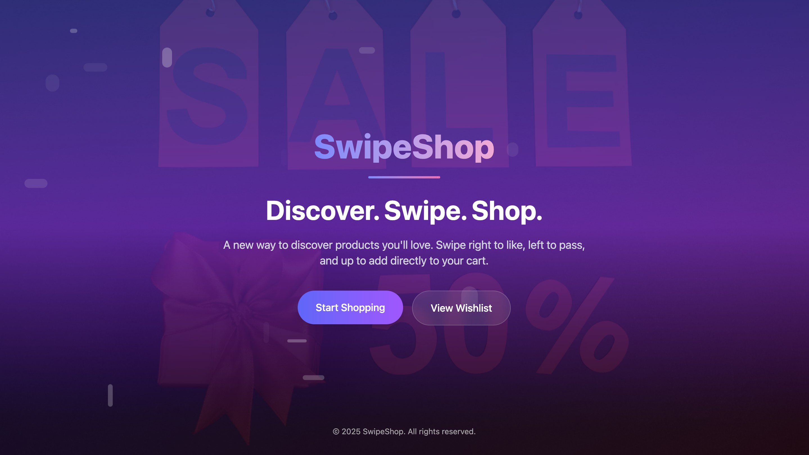
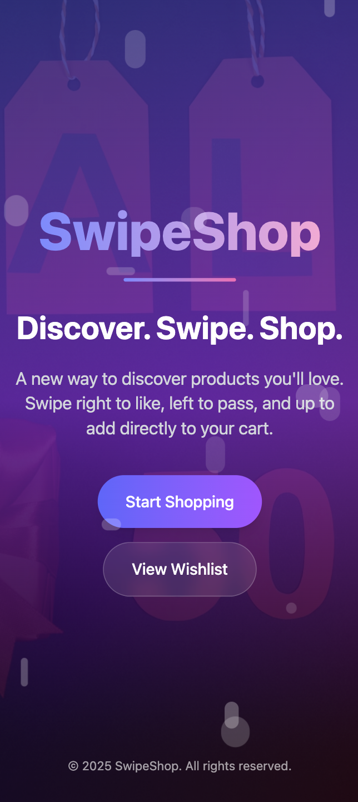
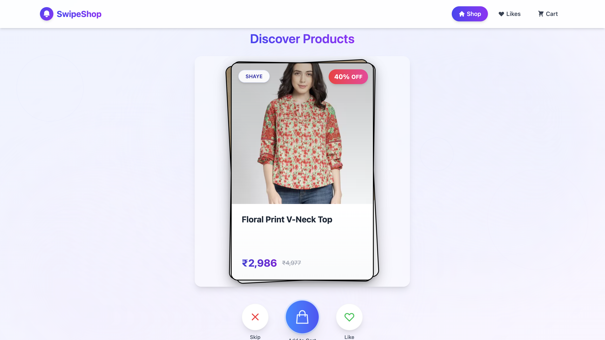
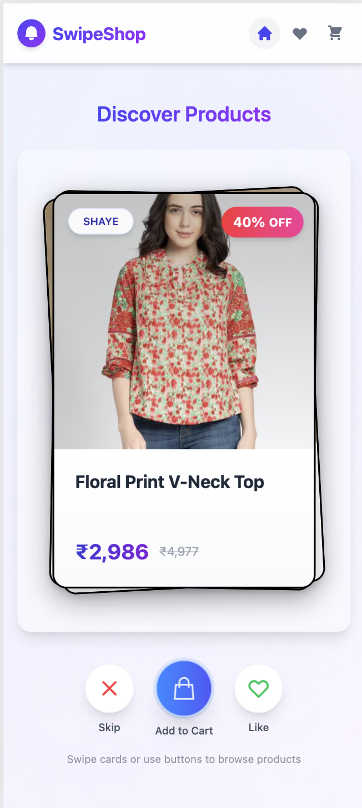
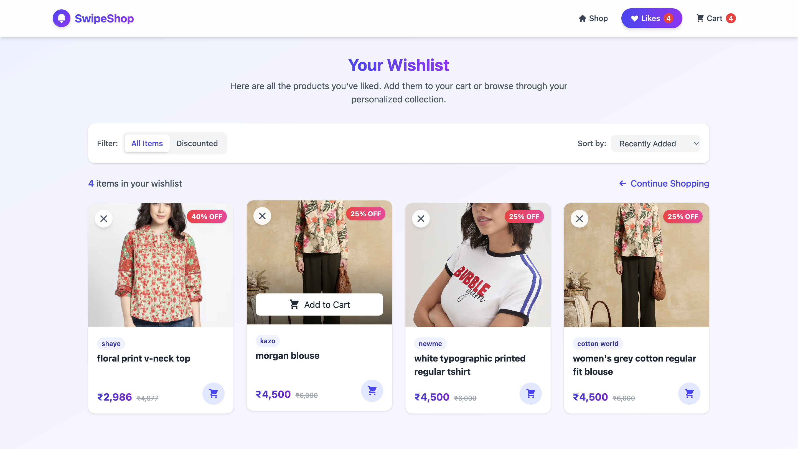
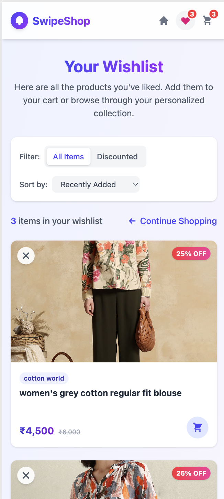
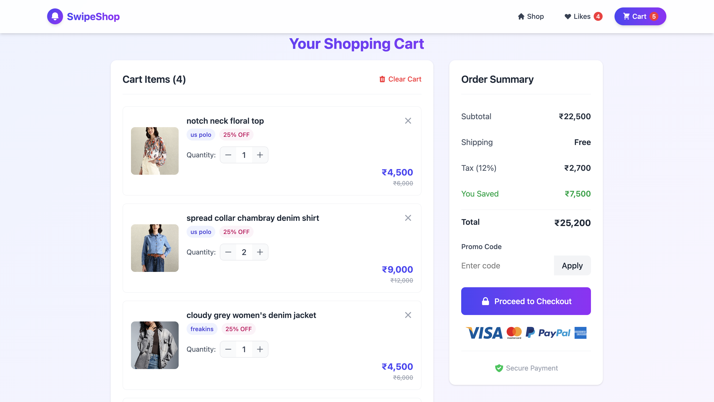
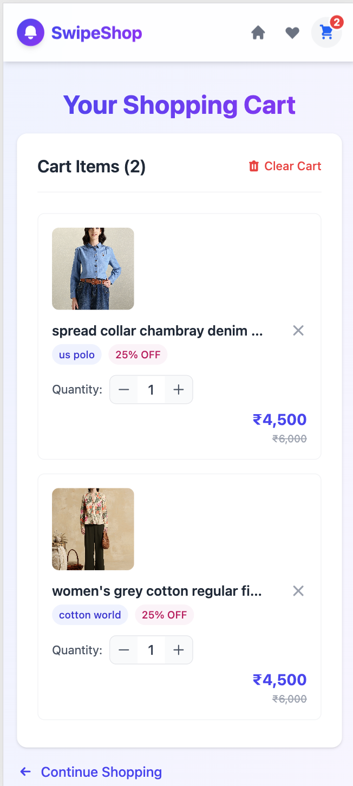

# SwipeShop

SwipeShop is a modern mobile-first shopping app with a Tinder-like swiping interface for discovering products. Built with React, Tailwind CSS, and Capacitor.js, it offers a seamless experience on both desktop and mobile.

---

## ✨ Features Overview

- **Product Discovery:** Swipe right to like, left to pass, up to add to cart
- **Product Cards:** Show image, name, brand, price, original price, and discount
- **Likes & Cart:** Manage liked products and shopping cart, with real-time feedback
- **Responsive UI:** Beautiful on both desktop and mobile
- **Animations:** Smooth transitions and swipe gestures
- **Mobile App Ready:** Package as an APK with Capacitor

---

## 🖼️ App Screenshots

### Landing Page
| Desktop | Mobile |
|--------|--------|
|  |  |

### Shopping (Swipe) Page
| Desktop | Mobile |
|--------|--------|
|  |  |

### Likes (Wishlist) Page
| Desktop | Mobile |
|--------|--------|
|  |  |

### Cart Page
| Desktop | Mobile |
|--------|--------|
|  |  |

---

## 🛠️ Functionality Details

### 1. Product Discovery (Shopping Page)
- Swipe **right**: Like a product (adds to wishlist)
- Swipe **left**: Pass on a product (removes from stack)
- Swipe **up**: Add to cart (removes from likes if already liked)
- Toast notifications for all actions
- Responsive card layout and beautiful background

### 2. Likes (Wishlist) Page
- View all liked products
- Add liked product to cart (removes from likes)
- Remove product from likes
- Sorting and filtering options
- Real-time feedback with toasts

### 3. Cart Page
- View products added to cart
- Increase/decrease quantity or remove items
- See total, savings, and tax
- Checkout-ready summary

### 4. Header & Navigation
- Brand logo and name
- Navigation links with icons
- Cart and likes count badges
- Mobile-friendly hamburger menu

### 5. Mobile App Packaging
- Built with Capacitor.js for easy APK generation
- Native-like experience on Android

---

## 🚀 Installation & Usage

### Prerequisites
- Node.js & npm
- Android Studio (for APK generation)

### 1. Clone the Repository
```bash
git clone https://github.com/yourusername/Swipe-Shop.git
cd Swipe-Shop
```

### 2. Install Dependencies
```bash
npm install
```

### 3. Run in Development
```bash
npm run dev
```
Open [http://localhost:5173](http://localhost:5173) in your browser.

### 4. Build for Production
```bash
npm run build
```

### 5. Mobile Packaging (Android APK)
```bash
npm run build
npx cap sync
npx cap open android
```
Then build the APK in Android Studio (see README instructions above).

---

## 📂 Screenshots Location
All screenshots used above are stored in `public/screenshots/`.

---

## 📱 Tech Stack
- React 19
- Tailwind CSS
- React Spring
- @use-gesture/react
- Capacitor.js
- Vite

---

## License
MIT
